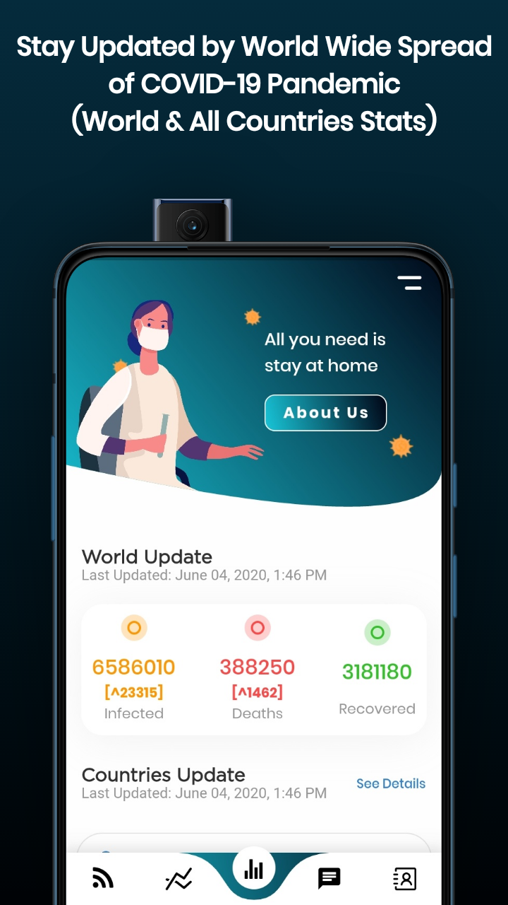
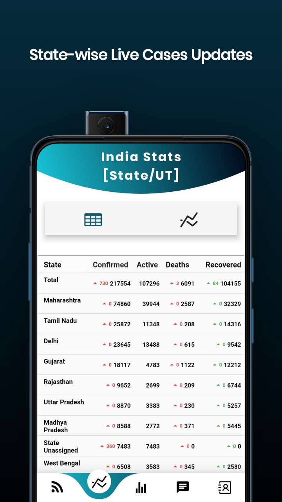
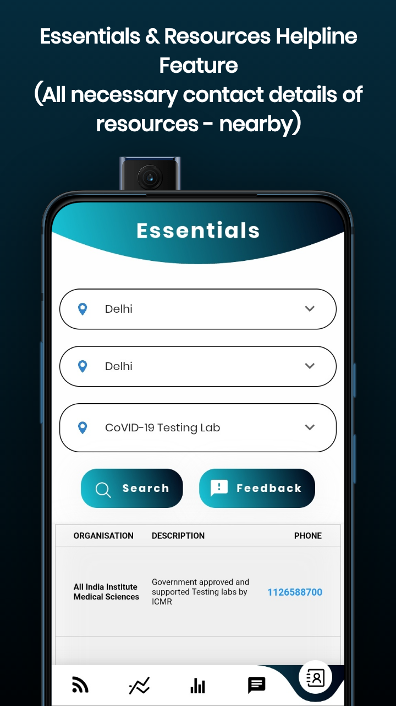
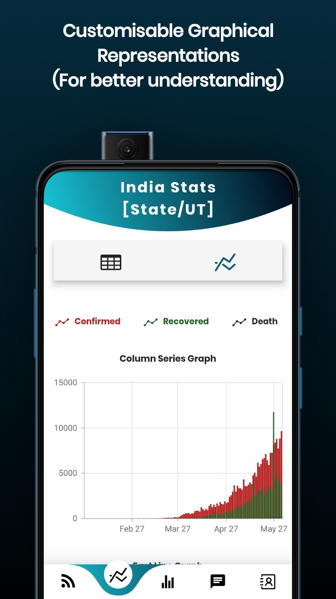
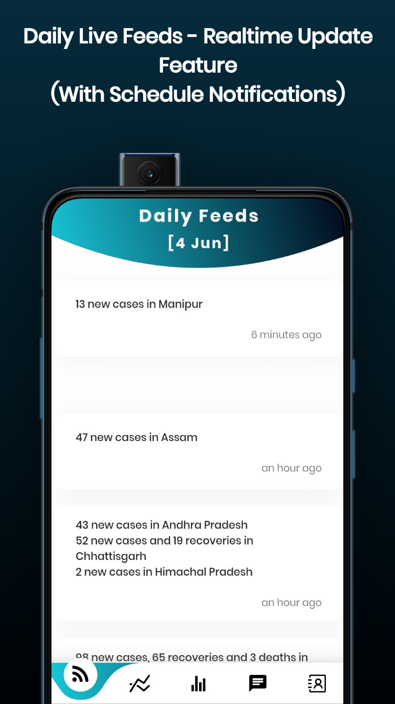
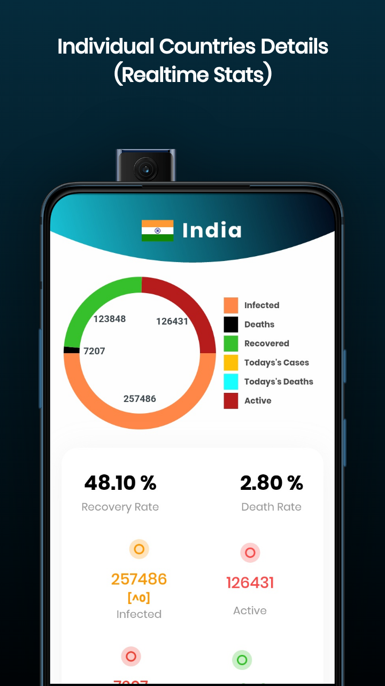
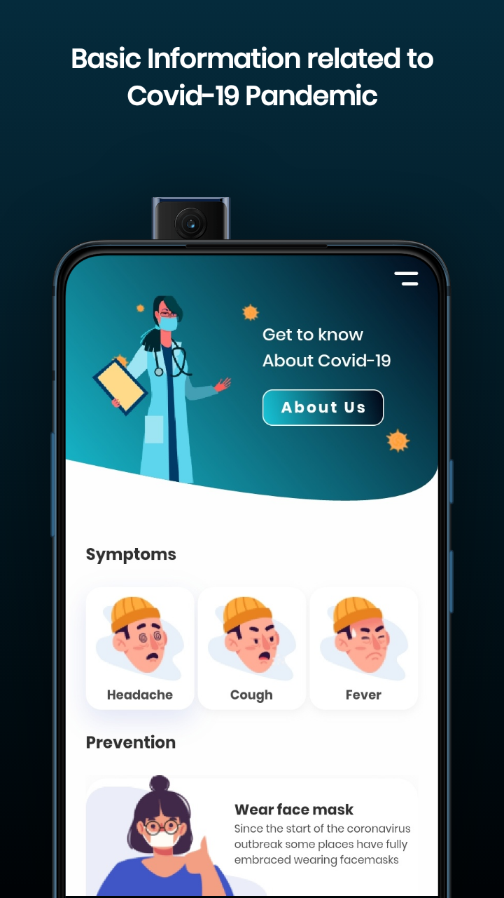

          

  

<h1 align="center">CareIndia</h1>
<h3 align="center">Stay Home and Be a Warrior</h3>

I have developed an android application "CareIndia" to keep track of COVID-19 Pandemic especially in India and stay updated with some useful features like-  
**• Daily Live Feeds-** Daily Feeds about cases in different states.  
**• Resources-** Get the Helpline details for all the State and City.   
**• Country Stats-** Individual countries stats with Pie Chart Representation.  
**• Statewise Stats & Graphical Representation-** Get all details of cases state-wise with graphical representation for better understanding.  
**• World and Countries Stats-** Get updates of World and countries cases.  

I have added **About Us(FAQ Section)** in case you want to know more.  

 
   

## Screenshots

# My Tech stack and tools

In this repository you can find a list of tools, programming language and frameworks that I would use to build any kind of project.

Some of the tools listed I'm gaining experience like Flutter, Firebase etc through reading blogs and tutorials that made me think it would be a great choice for some type of project like this App.

- [My Tech stack and tools](#my-tech-stack-and-tools)
  - [Methodologies and core values](#methodologies-and-core-values)
  - [Application Development](#application-development)
  - [Development Tools](#development-tools)
    - [Tools](#tools)
    - [Documentation](#documentation)
    - [Testing](#testing)
  - [Design](#design)
  - [Integrated API's](#integrated-api)
  - [Marketing and Analytics](#marketing-and-analytics)
  - [Other Tools](#other-tools)
  
  
## Methodologies and core values

* [Modern Agile](http://modernagile.org/)
* Devops
* Continuous Delivery
* "Operate what you build" - [see](https://medium.com/netflix-techblog/full-cycle-developers-at-netflix-a08c31f83249)

## Application Development

* **Programming Language** - Dart, Java, Kotlin
* **Development Tool** - Flutter

---

## Development Tools

### Tools

* [Flutter](https://flutter.dev/) - Flutter is Google’s UI toolkit for building beautiful, natively compiled applications for mobile, web, and desktop from a single codebase.
* [Firebase](https://firebase.google.com/) - A comprehensive app development platform 

### Documentation

* [Flutter - Docs](https://flutter.dev/docs) 
* [Firebase - Docs](https://firebase.google.com/docs)

### Testing 

* [Flutter Testing](https://flutter.dev/docs/testing) - Automated tests help ensure that your app performs correctly before you publish it, while retaining your feature and bug fix velocity.
* [Firebase - TestLab](https://firebase.google.com/docs/test-lab) - Test your app on devices hosted in a Google data center.

---

## Design

* [Flutter - Cookbook](https://flutter.dev/docs/cookbook) 
* [Google Fonts](https://fonts.google.com/) - Google Fonts is a library of 991 free licensed font families.
* [Iconfinder](https://www.iconfinder.com/) - 2,775,000+ free and premium vector icons. SVG, PNG, AI, CSH and PNG format.

## Integrated API's

* [COVID19-India API](https://api.covid19india.org/) - All India Data  
* [NOVELCovid/API](https://corona.lmao.ninja/docs/) - World and Countries Data

## Marketing and Analytics

* [Google Analytics](https://analytics.google.com/analytics/web/#/)
* [Google AdMob](https://admob.google.com/home/)
* [Google AdSense](https://www.google.com/intl/en_in/adsense/start/#/?modal_active=none)

## Other Tools 

* [Syncfusion](https://www.syncfusion.com/flutter-widgets) - Flutter Widgets - Fast, Fluid, and Flexible Widgets

## Deployment

I am not able to push this application on Google Playstore because of their new policy "Apps referencing COVID-19, or related terms, in any form will only be approved for distribution on Google Play if they are published, commissioned, or authorized by official government entities or public health organizations."  
For the above reason I'm sharing the Apk Link:   

   

<h3>Building</h3>

Android Release: `flutter build apk` 

Android (arm64-v8a)/(armeabi-v7a): `flutter build apk --split-per-abi`  

If you have a connected device or emulator you can run and deploy the app with `flutter run`    

## Contributors

| 👤 **Sudhanshu Kushwaha**                                   | 👤 **Nirbhay Singh Naruka**                                              |
| ----------------------------------------------------------- | ---------------------------------------------------------------------- |
|Github: [@itssudhanshu](https://github.com/itssudhanshu)  | Github: [@nirbhaysingh](https://github.com/nirhbaysingh)   |
|LinkedIn: [@sudhanshu0299](https://linkedin.com/in/sudhanshu0299)  | LinkedIn: [@nirbhay13](https://www.linkedin.com/in/nirbhay13/)|

### :heart: Found this project useful?

If you found this project useful, then please consider giving it a :star: on Github and sharing it with your friends via social media.

## License

This project is licensed under the MIT License - see the [LICENSE.md](LICENSE.md) file for details

